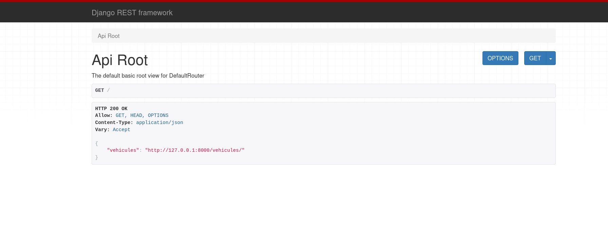
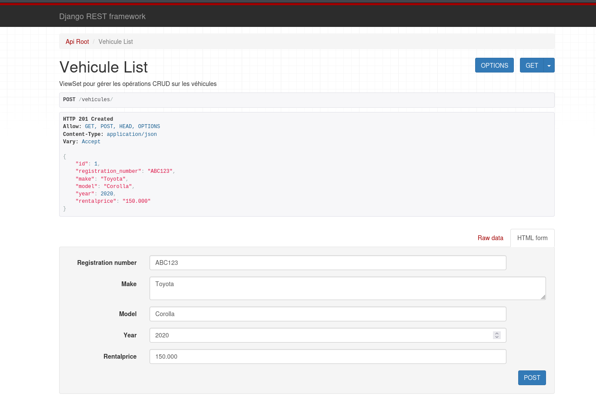

# TP-PROPELIZE

# LANCER L'APPLICATION
¸¸¸
git clone https://github.com/SIGL-L3/TP_PROPELIZE_GROUPE_8.git

cd TP_PROPELIZE_GROUPE_8/propelize

source ../.venv/bin/activate

pip3 install -r requirement.txt

python3 manage.py migrate
¸¸¸

Lancer dans le lien dans le navigateur : http://127.0.0.1:8000

Lancer : http://127.0.0.1:8000/vehicules/

Remplir le formulaire et cliquer sur "POST" pour creer un nouveau vehicule

