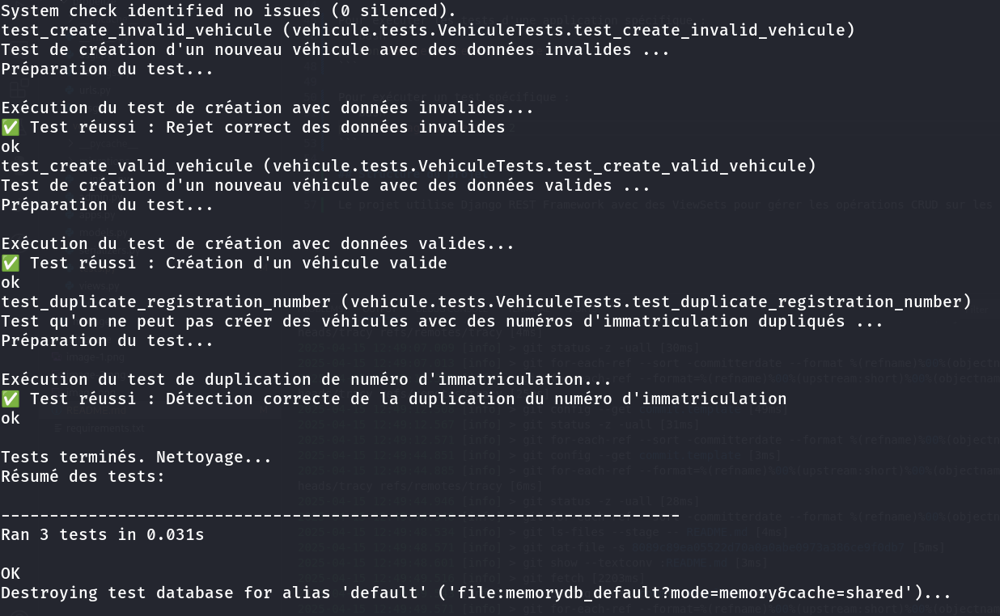

# TP-PROPELIZE

## Installation et lancement de l'application

```bash
# Cloner le dépôt
git clone https://github.com/SIGL-L3/TP_PROPELIZE_GROUPE_8.git

# Accéder au répertoire du projet
cd TP_PROPELIZE_GROUPE_8/propelize

# Activer l'environnement virtuel
source ../.venv/bin/activate

# Installer les dépendances
pip install -r requirements.txt

# Appliquer les migrations
python manage.py migrate

# Lancer le serveur de développement
python manage.py runserver
```

## Accès à l'application

Accédez à l'application dans votre navigateur :
- Interface principale : http://127.0.0.1:8000
- API des véhicules : http://127.0.0.1:8000/vehicules/

## Utilisation de l'API des véhicules

1. Accédez à l'interface de l'API : http://127.0.0.1:8000/vehicules/
2. Pour créer un nouveau véhicule :
   - Remplissez le formulaire avec les informations requises
   - Cliquez sur le bouton "POST"

## Lancement des tests

Pour exécuter tous les tests :
```bash
python manage.py test
```

Pour exécuter les tests d'une application spécifique :
```bash
python manage.py test vehicule
```

Pour exécuter un test spécifique :
```bash
python manage.py test -v 2
```


## Structure du projet

Le projet utilise Django REST Framework avec des ViewSets pour gérer les opérations CRUD sur les véhicules.